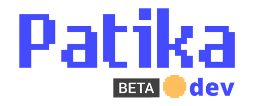

# Kodluyoruz İlk Repo
Bu repo Kodluyoruz Front-End Eğitiminde oluşturduğumuz ilk repo. İçerisinde bir adet README dosyası, bir adet de index.html barındırıyor.

--------------------------

## Installation
**Öncelikle projeyi clonelayın.** 

>[Repomun linki için tıklayınız.](https://github.com/Laviya/kodluyoruzilkrepo.git)

(Buraya sizin reponuzdan aldığınız link gelecek)
```
git clone https://github.com/userName/kodluyoruzilkrepo.git
```

Linux için:

```
cd kodluyoruzilkrepo
code .
```

--------------------------

## Usage

Projeyi cloneladıktan sonra Visual Studio Code programında açınız.

--------------------------

## Contributing

Pull requestler kabul edilir. Büyük değişiklikler için, lütfen önce neyi değiştirmek istediğinizi tartışmak için bir konu açınız.

--------------------------

## License

[MİT](LICENSE)

--------------------------

